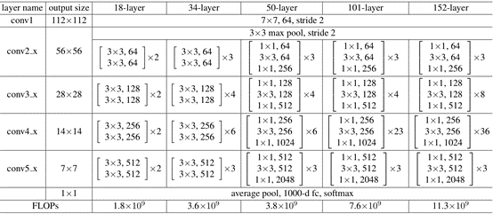
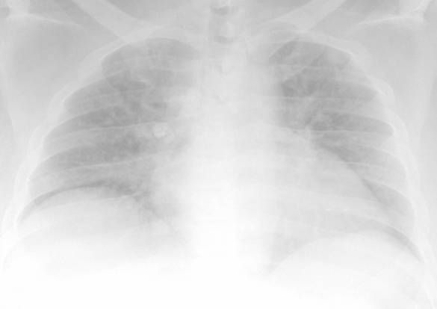
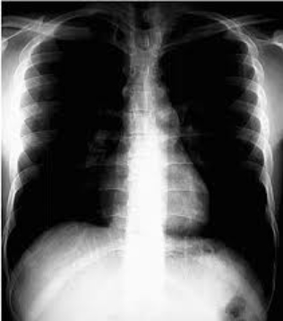
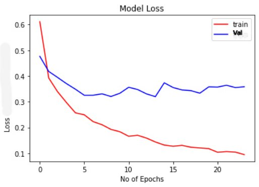

# A comparative analysis of different CNN Architectures for Pulmonary Disease

**TRIBHUVAN UNIVERSITY**

**INSTITUTE OF ENGINEERING**

**THAPATHALI CAMPUS**

**A Project Report**

**On**

**A comparative analysis of different CNN Architectures for Pulmonary Disease**

**Classification: Inception v3 vs. ResNet-50**

**Submitted By:**

Amit Raj Pant (THA076BCT005)

Pilot Khadka (THA076BCT025)

Rajin Khatri (THA076BCT034)

Sujan Lamichhane (THA076BCT045)

**Submitted To:**

Department of Electronics and Computer Engineering

Thapathali Campus

Kathmandu, Nepal

March, 2023

**TRIBHUVAN UNIVERSITY**

**INSTITUTE OF ENGINEERING**

**THAPATHALI CAMPUS**

**A Project Report**

**On**

**A comparative analysis of different CNN Architectures for Pulmonary Disease**

**Classification: Inception v3 vs. ResNet-50**

**Submitted By:**

Amit Raj Pant (THA076BCT005)

Pilot Khadka (THA076BCT025)

Rajin Khatri (THA076BCT034)

Sujan Lamichhane (THA076BCT045)

**Submitted To:**

Department of Electronics and Computer Engineering

Thapathali Campus

Kathmandu, Nepal

In partial fulfillment for the award of the Bachelor’s Degree in Electronics and

Computer Engineering.

**Under the supervision of**

Er. Suramya Sharma Dahal

March, 2023
# **DECLARATION**
We hereby declare that the report of the project entitled “**A comparative analysis of different CNN Architectures for Pulmonary Disease Classification: Inception v3 vs. ResNet-50**” which is being submitted to the **Department of Electronics and Computer Engineering, IOE, Thapathali Campus**, in the partial fulfillment of the requirements for the award of the Degree of Bachelor of Engineering in **Computer Engineering**, is a bonafide report of the work carried out by us. The materials contained in this report have not been submitted to any University or Institution for the award of any degree and we are the only author of this complete work and no sources other than listed here have been used in this work.

Amit Raj Pant (Class Roll No: [076/BCT/005])	\_\_\_\_\_\_\_\_\_\_\_\_\_\_\_\_\_\_\_\_\_\_\_\_\_\_

Pilot Khadka (Class Roll No: [076/BCT/025])	\_\_\_\_\_\_\_\_\_\_\_\_\_\_\_\_\_\_\_\_\_\_\_\_\_\_

Rajin Khatri (Class Roll No: [076/BCT/034])	\_\_\_\_\_\_\_\_\_\_\_\_\_\_\_\_\_\_\_\_\_\_\_\_\_\_

Sujan Lamichhane (Class Roll No: [076/BCT/045])	\_\_\_\_\_\_\_\_\_\_\_\_\_\_\_\_\_\_\_\_\_\_\_\_\_\_

**Date**: March, 2023

# **CERTIFICATE OF APPROVAL**
The undersigned certify that they have read and recommended to the **Department of Electronics and Computer Engineering, IOE, Thapathali Campus**, a minor project work entitled “**A comparative analysis of different CNN Architectures for Pulmonary Disease Classification: Inception v3 vs. ResNet-50**” submitted by **Amit Raj Pant, Pilot Khadka, Rajin Khatri** and **Sujan Lamichhane** in partial fulfillment for the award of Bachelor’s Degree of Electronics and Communication Engineering. The project was carried out under special supervision and within time frame prescribed by the syllabus.

We found the students to be hardworking, skilled and ready to undertake any related work to their field of study and hence we recommend the award of partial fulfillment of Bachelor’s degree of Electronics and Communication Engineering.

\_\_\_\_\_\_\_\_\_\_\_\_\_\_\_\_\_\_\_\_\_\_\_\_\_\_\_\_\_\_\_\_\_\_\_\_\_\_\_

Project Supervisor

Er. Suramya Sharma Dahal

Department of Electronics and Computer Enginering, Thapathai Campus

\_\_\_\_\_\_\_\_\_\_\_\_\_\_\_\_\_\_\_\_\_\_\_\_\_\_\_\_\_\_\_\_\_\_\_\_\_\_\_

External Examiner

\_\_\_\_\_\_\_\_\_\_\_\_\_\_\_\_\_\_\_\_\_\_\_\_\_\_\_\_\_\_\_\_\_\_\_\_\_\_\_

Project Coordinator

Er. Umesh Kanta Ghimire

Department of Electronics and Computer Enginering, Thapathai Campus

\_\_\_\_\_\_\_\_\_\_\_\_\_\_\_\_\_\_\_\_\_\_\_\_\_\_\_\_\_\_\_\_\_\_\_\_\_\_\_

Mr. Kiran Chandra Dahal

Head of the Department,

Department of Electronics and Computer Engineering, Thapathali Campus

March, 2023
# **COPYRIGHT**
The author has agreed that the library, Department of Electronics and Computer Engineering, Thapathali Campus, may make this report freely available for inspection. Moreover, the author has agreed that the permission for extensive copying of this project work for scholarly purpose may be granted by the professor/lecturer, who supervised the project work recorded herein or, in their absence, by the head of the department. It is understood that the recognition will be given to the author of this report and to the Department of Electronics and Computer Engineering, IOE, Thapathali Campus in any use of the material of this report. Copying of publication or other use of this report for financial gain without approval of the Department of Electronics and Communication Engineering, IOE, Thapathali Campus and author’s written permission is prohibited.

Request for permission to copy or make any use of the material in this project in whole or part should be addressed to department of Electronics and Computer Engineering, IOE, Thapathali Campus.

# **ACKNOWLEDGEMENT** 
We would like to acknowledge the Institute of Engineering, Tribhuvan University for including minor project in the syllabus of Bachelor’s in Computer Engineering. 

We would also like to express our sincere thankfulness towards the Department of Electronics and Computer engineering, Thapathali Campus for the guidance and support for preparing this proposal. We would also like to express our gratitude towards our supervisor Er. Suramya Sharma Dahal for his guidance throughout this project. Also, we express our admiration towards all the friends who have been helping us in this project.

Amit Raj Pant (THA076BCT005)

Pilot Khadka (THA076BCT025)

Rajin Khatri (THA076BCT034)

Sujan Lamichhane (THA076BCT045)

# **ABSTRACT**
Lung disease, also known as pulmonary disease, is a broad term that refers to any condition that affects the lungs and impairs their ability to function properly. X-ray may show changes in the appearance of lungs which may be due to certain diseases. In this project, we utilize chest X-ray as input and employ two different CNN models (Resnet-50 and Inception-v3) for classification task. The goal is to accurately identify if the person has Tuberculosis, Pneumonia or Healthy lungs. The performance of the two models were evaluated using the lung image of patients diagnosed with the mentioned diseases. The evaluation metrics used are accuracy, precision, and recall. This project demonstrates the potential of CNNs in the accurate and efficient diagnosis of lung diseases using chest X-ray images and highlights the importance of comparing different models for a given task.

*Keywords: CNN, Machine Learning, Pneumonia, Tuberculosis, X-ray,* 

**Table of Contents**

[DECLARATION	iii****](#_Toc128855745)**

[**CERTIFICATE OF APPROVAL	iv****](#_Toc128855746)

[**COPYRIGHT	v****](#_Toc128855747)

[**ACKNOWLEDGEMENT	vi****](#_Toc128855748)

[**ABSTRACT	vii****](#_Toc128855749)

[**List of Figures	xi****](#_Toc128855750)

[**List of Tables	xii****](#_Toc128855751)

[**List of Abbreviations	xiii****](#_Toc128855752)

[**1.**	**INTRODUCTION	1****](#_Toc128855753)

[1.1.	Background	1](#_Toc128855754)

[1.2.	Motivation	2](#_Toc128855757)

[1.3.	Problem Definition	3](#_Toc128855761)

[1.4.	Objective	3](#_Toc128855762)

[1.5.	Project Scope	3](#_Toc128855763)

[1.6.	Report Organization	3](#_Toc128855764)

[**2.**	**LITERATURE REVIEW	5****](#_Toc128855765)

[**3.**	**REQUIREMENT ANALYSIS	7****](#_Toc128855766)

[3.1.	Functional Requirement	7](#_Toc128855773)

[3.2.	Non-Functional Requirements	8](#_Toc128855778)

[3.3.	Other Requirements	8](#_Toc128855779)

[3.3.1.	Languages and Frameworks	9](#_Toc128855801)

[3.3.2.	Software libraries	9](#_Toc128855802)

[**4.**	**SYSTEM ARCHITECTURE AND METHODOLOGY	11****](#_Toc128855803)

[4.1.	System Architecture	11](#_Toc128855815)

[4.1.1.	Choosing models	12](#_Toc128855822)

[4.1.2.	ResNet-50	12](#_Toc128855823)

[4.1.3.	Inception-v3	15](#_Toc128855824)

[4.2.	Evaluation Metrics	20](#_Toc128855825)

[4.2.1.	Accuracy	20](#_Toc128855829)

[4.2.2.	Precision	20](#_Toc128855830)

[4.2.3.	Recall	21](#_Toc128855833)

[4.2.4.	F1 score	21](#_Toc128855834)

[4.3.	Algorithm	22](#_Toc128855835)

[**5.**	**IMPLEMENTATION DETAILS	23****](#_Toc128855836)

[5.1.	Website Implementation	23](#_Toc128855842)

[5.1.1.	Frontend Implementation	23](#_Toc128855847)

[5.1.2.	Backend Implementation	23](#_Toc128855848)

[5.2.	Dataset preparation	23](#_Toc128855849)

[5.2.1.	Data Cleaning	24](#_Toc128855855)

[5.2.2.	Dataset Splits	27](#_Toc128855860)

[5.2.3.	Class Imbalance Problem	27](#_Toc128855861)

[5.3.	Preprocessing Layers	28](#_Toc128855862)

[5.4.	Normalization Layer	28](#_Toc128855864)

[5.5.	Augmentation Layer	28](#_Toc128855865)

[5.6.	Global Average pooling layer	29](#_Toc128855876)

[5.7.	Resnet-50 Implementation	30](#_Toc128855877)

[5.8.	Inception-v3 Implementation	32](#_Toc128855878)

[5.9.	Confusion Matrix, Classification Report, and Heat Map Plot	34](#_Toc128855879)

[**6.**	**RESULTS AND ANALYSIS	35****](#_Toc128855880)

[6.1.	Performance of the Models with Small Dataset with no Augmentation	35](#_Toc128855884)

[6.2.	Performance of Models with Large Dataset	36](#_Toc128855885)

[6.3.	Performance of the Models with Refined Dataset	37](#_Toc128855886)

[6.3.1.	Resnet-50	37](#_Toc128855887)

[6.3.2.	Inception V3	39](#_Toc128855893)

[6.4.	Confusion Matrix	41](#_Toc128855894)

[6.4.1.	Confusion Matrix for Resnet-50	41](#_Toc128855895)

[6.4.2.	Confusion Matrix for Inception V3	42](#_Toc128855902)

[6.5.	Classification Report	43](#_Toc128855903)

[6.5.1.	Classification report of Resnet-50	44](#_Toc128855904)

[6.5.2.	Classification report of Inception-v3	44](#_Toc128855905)

[6.6.	Comparison Table of Resnet-50 and Inception-v3	46](#_Toc128855906)

[**7.**	**FUTURE ENHANCEMENTS	47****](#_Toc128855907)

[**8.**	**CONCLUSION	48****](#_Toc128855908)

[**9.**	**APPENDICES	49****](#_Toc128855909)

[**REFERENCES	50****](#_Toc128855910)

# **List of Figures**
[Figure 31: Use Case Diagram	7](#_Toc128855911)

[Figure 41: System Architecture	11](#_Toc128855912)

[Figure 42: Skip Connection	12](#_Toc128855913)

[Figure 43: Architecture of ResNet-50	13](#_Toc128855914)

[Figure 44: Resnet-50 architecture. Building blocks shown in brackets with no. of blocks stacked	14](#_Toc128855915)

[Figure 45: Inception v3 architecture	15](#_Toc128855916)

[Figure 46: Inception Architecture Block A	16](#_Toc128855917)

[Figure 47: Stem block	17](#_Toc128855918)

[Figure 48: Inception architecture block B	18](#_Toc128855919)

[Figure 49: Inception architecture block C with factorized convolution	19](#_Toc128855920)

[Figure 51: Lung dataset for each class	24](#_Toc128855921)

[Figure 52: A sample Image from each class	24](#_Toc128855922)

[Figure 53: Under-penetrated Lung X-ray	25](#_Toc128855923)

[Figure 54: Over-penetrated Lung X-ray	26](#_Toc128855924)

[Figure 55: Dataset after data cleaning	27](#_Toc128855925)

[Figure 56: Sample image demonstrating data augmentation	29](#_Toc128855926)

[Figure 57: Resnet-50 implementation	31](#_Toc128855927)

[Figure 58: Inception-v3 implementation	33](#_Toc128855928)

[Figure 61: Accuracy of Resnet-50 with refined dataset	38](#_Toc128855929)

[Figure 62: Loss of Resnet-50 with refined dataset	39](#_Toc128855930)

[Figure 63: Accuracy of Inception-v3 with refined dataset	40](#_Toc128855931)

[Figure 64: Loss of Inception-v3 with refined dataset	41](#_Toc128855932)

[Figure 65: Confusion Matrix for Resnet-50	42](#_Toc128855933)

[Figure 66: Confusion Matrix for inceptiion-v3	43](#_Toc128855934)

# **List of Tables**
[Table 61: Accuracy and Loss of Resnet-50 for Small Dataset	35](#_Toc128840892)

[Table 62: Accuracy and Loss of inception-v3 for Small Dataset	36](#_Toc128840893)

[Table 63: Accuracy and Loss of Inception-v3 for Large balanced Dataset	37](#_Toc128840894)

[Table 64: Accuracy and Loss of Resnet-50 for Large balanced Dataset	37](#_Toc128840895)

[Table 65: Classification report of Resnet-50:	44](#_Toc128840896)

[Table 66: Classification report of Inception-v3	44](#_Toc128840897)

[Table 67: Comparison of Resnet-50 with Inception-v3	46](#_Toc128840898)

[Table 91: Project Timeline	49](#_Toc128840899)

# **List of Abbreviations**

|AI|Artificial Intelligence|
| :- | :- |
|CNN|Convolutional Neural Network|
|CT|Computed tomography|
|CXR|Chest X-ray|
|FN|False Negative|
|FP|False Positive|
|GB|Gigabyte|
|GPU|Graphics Processing Unit|
|MRI|Magnetic resonance imaging|
|PNG|Portable Network Graphics|
|RSNA|Radiological Society of North America|
|TB|Tuberculosis|
|TN|True Negative|
|TP|True Positive|
|UNICEF|United Nations International Children's Emergency Fund|
|WHO|World Health Organization|

xiii

1. # **INTRODUCTION**
Pneumonia is an acute respiratory infection affecting the lungs. Its cause mainly includes bacteria, funguses or viruses leaving the affected person’s chest filled with pus or fluid. Tuberculosis is another bacterial infection affecting an individual through the coughs or sneezes of an infected person. Though its main area of effect is the lungs, it could also affect other human body parts including the abdomen, glands, or bones. People suffering from such lung diseases have a tough time breathing, causing them to have a lot of problems in their daily activities and sometimes can even be the reason for their death.

Transfer Learning is the improvement of learning in a new task through the use of knowledge obtained in the past. It has always been a huge part of research related to images and their classification. In Transfer Learning, we first use a pre-trained model and use its knowledge into finding the answer of another. An analogy of this can be seen as using Transfer Learning in recognizing a drink using a model that has been trained to recognize foods. For the best results, we use Convolutional Neural Network that are much helpful in finding patterns in an image. The CNN learns from the data directly to recognize the patterns of the objects. Another huge part of using CNN is that it can learn without any kind of external human supervision. We only provide the dataset and based on that data, the CNN can find patterns and classify them.

Using the best of CNN and transfer learning, we can develop a system that helps not only the medical practitioners but the country as a whole. It is a lower economy country that suffers mostly from lung diseases. Using this system. It’s easy to predict the probability of the diseases which can be highly effective in preventing the disease and also curing it completely. It also greatly helps us in knowing the accuracy obtained through these pre-trained models in the detection of various diseases. This project can start as a base for the prediction of other diseases using a similar system.
1. ## **Background**
According to a press release done by UNICEF Nepal, Pneumonia has claimed the life of 800,000 children or a child every 19 seconds. In Nepal, this disease has caused 13 per-cent of under five deaths. They project that in poor countries like Nepal, over 18,000 children could die between the year 2020 and 2030 following the current trends. [1] Another report BY WHO about the tuberculosis burden of Nepal found that 117,000 thousand people with TB disease are living in Nepal as of 2018. It is an exceedingly high number of people suffering looking at how small our country is. [2]

There have been many advances in medicine and computer technology to help prevent these diseases. However not everyone has been able to enjoy the luxury of medical facilities and technology due to their limited economy and facilities. There also have been systems developed that can prevent such diseases but the system only worked for a particular disease. So, with our project, we intend to create a system that can bring some change in the existing system and make it accessible to most people. They can use this system to find out about their potential contact to disease which can play a huge role in its prevention and cure. 

   1. ## **Motivation** 
Report published by the National Tuberculosis Control Center shows that TB is the top ten leading causes of death in Nepal. As of 2020, 27,745 TB cases were reported in Nepal. Also, they estimate that 68,000 new cases will be recorded each year which includes 67% male and 33% female and can result in as much as 17,000 deaths. [3]Another data from 2073-74 shows that a total of 194662 pneumonia cases were recorded where 66 out of 1000 children under the age of 5 were infected by it. [4]With this new advancement in technology the number can be dropped significantly. Our system will be helpful in contributing to decreasing the number by making it easy for the doctors and professionals to predict the disease. It can take a lot of time for human eyes to see the patterns in the X-rays of the chest. Missing a minute detail in such cases can be fatal. However, with the use of an AI, this can be done with higher accuracy. Our system can be used by people with easy access in case they cannot have proper meetings with the professionals. It can enable them to take prompt action. We want to bring the best out of AI and technology out there. We wish to help the professionals even if it is only a minor help to them. Our action can result in helping thousands and thousands of people across the World. 

   1. ## **Problem Definition**
Different Models of Machine Learning Algorithms exits for classifying images so it hard to know which model best suits the purpose of medical image classification. Our purposed project focuses on comparing different CNN architecture models for pulmonary disease classification (Tuberculosis and Pneumonia) where we will be classifying two different categories of lung diseases.
1. ## **Objective**
The main objectives of our project are enlisted below:

- To compare the performance of Inception v3 and ResNet-50 for pulmonary disease classification.
- To develop a system that can classify Pneumonia and Tuberculosis from an X-ray.
  1. ## **Project Scope**
Our project can be used by anyone using their device to learn about their current condition. Also, it can be used by the medical experts to predict the disease easily and more accurately. Furthermore, it can also be used by new trainee medical personnel to compare their expertise against a system helping them to learn more along the process. It can also be a significant help to the people designing new systems to decide which model to use in their work for the most efficient and accurate results.
1. ## **Report Organization**
The report starts with the Introduction chapter which gives a brief introduction to the project and also provides information about our motivations and project scopes as well. Following this we have Literature Review, where we have discussed about the past and current works done on similar project as ours. This chapter deals with the research done by our team. It also describes the work done on the projects available and the results obtained on these projects. Following this, we have Requirement Analysis, which deals with the functional and non-functional requirements of this project. The functional requirements show what we desire to achieve in this project with the help of a use case diagram whereas the non-functional requirements talks about the several performance factors of our project. Also we have discussed about the software requirements of this project. The next chapter is the System Architecture and Methodology. This chapter starts with our system architecture over which our system is based upon. It also includes the methodology section where the method of achieving our result has been described in detail. The next chapter is the Implementation details, where the entire project has been described in great detail. The chapter deals with the dataset preparation, preprocessing image and the implementation of models in our system. It also talks about the other parameters used in this system for measuring the performance of our system. Following this, we move on to Results and Analysis. This section deals with the various results that we have encountered throughout this project. We also provide a brief explanation to the cause behind such results. Finally, we have the final result obtained in this project which will be used for the classification purposes. We also have the comparison with our old results and we have analyzed them through the use of graphs and confusion matrices. Next up is the Future Enhancements where the future plan for our project has been laid out. We discuss about the exclusions in our project and what new features will be added in the project in the future. Finally we have the Conclusion chapter giving a brief report of the entire project and works done in this project. The final chapter Appendices talk about the time distribution of the work in our project.

2. # **LITERATURE REVIEW** 
Most modern deep-learning networks are heavily based on the development of the convolutional neural networks dating back to the 1980s, when first ever CNN Neocognitron was developed. [5]

The development of CNNs (Convolutional Neural Network) and their application in medical image classification started with the development of the LeNet model by Yann LeCun and his colleagues in the 1990s, which was among the first model to demonstrate the effectiveness of CNNs for image recognition. [6]

The ResNet model as introduced by researchers at Microsoft in 2015 [7]. The paper's authors introduced a method to solve vanishing gradient phenomenon which occurs when the gradient of the error function becomes small as it is propagated back through the network during training. They introduced use of shortcuts in between layers to pass the parameters directly to other layers. The first introduced ResNet was ResNet-20 which had 20 layers. 

Recently, in 2022 ML researchers used ResNet-50 for detecting COVID-19 in chest X-ray images [8]. Their work achieved 99.17% validation accuracy, 99.95% train accuracy, 99.31% precision, 99.03% sensitivity, and 99.17% F1-score.

A team of researchers used transfer learning approaches to train different models for Pneumonia Classification from X-ray Images and outperformed all state-of-the-art methods. They used multiple pre-trained convolutional neural network (CNN) variants such as VGG16, Inception-v3, and ResNet50. On measuring the performance of each model, the Inception-V3 with CNN attained the highest accuracy and recall score of 99.29% and 99.73%. [9]

The Inception-V3 model is improved and updated version of the Inception-V1 model which uses several approaches to optimize the network [10]. This model is a deep CNN that is easy to train but might take longer time up to several days and can be trained on a low-configuration computer.

Another work on Pneumonia Detection on Chest X-ray Images was using Ensemble of Deep CNN. They used three well-known CNNs (DenseNet169, MobileNetV2, and Vision Transformer) pretrained on the ImageNet database. These models were later fine-tuned on the chest X-ray data set. Their EL approach outperformed other existing methods and obtained an accuracy of 93.91% and a F1-score of 93.88% on the testing phase. [11]

Recent Algorithms for classifying Chest X-ray images for TB identification use transfer learning implemented on pre-trained models like AlexNet, MobileNet, ResNet and GoogLeNet. These models were found to perform poorly when transferred on medical image classification with the limited number of images. [12]A hybrid method was proposed and it proved to be better over these existing methods for classification of 14 chest diseases produced system accuracy of 84.62%. They were able to achieve a training loss of 0.0439, training accuracy of 98.41%, validation loss of 0.0639 and validation accuracy of 98.18% on only 20 epochs using this customized deep CNN model which was trained from scratch. [13] They were able to out form ResNet-50 mode which gave precision of about 91.14%. 
2. # **REQUIREMENT ANALYSIS**

   1. ## **Functional Requirement**

Figure 31: Use Case Diagram

Functional requirement define what system must do and expected outcomes of its operations. They also describe the desired behavior and performance characteristics of the system. Our functional requirements include:

**Upload:** The system must allow users to upload the image of the X-ray of lung

**Predict**: The system shall predict whether the given image is healthy lung or is suffering from Pneumonia or Tuberculosis.

**Compare** **Models**: The system shall be able to compare the two models inception-v3 and Restnet-50 and provide performance metrices of both.

**Result**: The system shows the disease predicted in proper UI.

   2. ## **Non-Functional Requirements** 
Non-functional requirements are conditions that our system must meet in order to deliver quality and performance. Non-functional requirements of our project are 

**Performance**: The system must be able to respond to images provided by the user within 5 seconds.

**Accuracy**: The system must accurately predict the between the diseased and healthy lung.

**Accessibility:** The system must be accessible to anyone. 
2. ## **Other Requirements**
Other requirements for our project include various software components and software libraries .No hardware Components are to be used for our project.

      1. ### **Languages and Frameworks**
- **Python:** It is one of the most popular and powerful programming language available today. We are using python as our main programming language for our project as it contains many libraries required for our project like TensorFlow, keras, matplotlib. It is also used for our backend development in Django framework for API development.
- **React:** It is a framework based on JavaScript programming language it is required for development of UI in our project through which the user can upload the image of X-ray and find out the result and also the comparison of the models.
  1. ### **Software libraries**
**TensorFlow**: It is an open source software library primarily used for machine learning and deep learning applications and provide platform for training our models .It is highly customizable and allows to build complex models and training algorithms.

**Keras**: It is an open-source deep learning framework written in python which is user friendly and modular to create and experiment with different neural network architectures for our case Inception v3 and Restnet-50.

**Matplotlib:** It is primarily used for plotting the features and visualizing data in our project.

**Requests:** Request is library in python which allows to send HTTP requests easily without the need to add query strings to URLs.

**Scikit learn:** It is a powerful and robust library for machine learning which is written in python and provides selection of efficient tools for classification, regressing and clustering via consistence interface in Python. It is used for calculating metrices like precision, recall, f1 score and class weights.

**Shutil:** Provides high- level file operations and used for data organization in our project.

**OS:** This library is used to perform basic os functions in our project.

**Seaborn:** Seaborn is a Python data visualization library based on matplotlib. It is used for confusion matrix heat map plot.

4. # **SYSTEM ARCHITECTURE AND METHODOLOGY** 

   1. ## **System Architecture**

Figure 41: System Architecture

The above figure covers the working architecture of our system. It covers the data augmentation, training, testing and validation of the models and then finally choosing our best trained model for the purpose of our classification. The dataset is manually prepared and only then used for the training and testing of the model. The process of the dataset preparation has been described in detail later. Once the dataset is prepared, it is sent to the models for processing and classification.

      1. ### **Choosing models**
Considering the limited computation available and the desire for high accuracy for health classification, the decision of transferred learning was preferred. The two networks were picked based on Top-1 accuracy and computational cost. 
1. ### **ResNet-50**
Since 2013, the deep learning community started to build deeper and deeper networks as they improved the performance of the system and its accuracy but one main issue the community later realized was vanishing gradient problem, which occurs when the gradients of the parameters with respect to the loss function become extremely small as the network becomes deeper. This makes it difficult for the network to learn and can lead to inferior performance.

Figure 42: Skip Connection

ResNet addresses this issue by introducing a concept called "skip connections," which allow the network to bypass one or more layers and directly connect the input to the output. This helps to alleviate the vanishing gradient problem and allows the network to learn more effectively. The ResNet-50 is one of such models.

Figure 43: Architecture of ResNet-50

ResNet-50 was introduced in 2015 and is a variant of the ResNet model. It consists of a 50-layer convolutional neural network with 48 convolution layers, one Max-pool layer and one average pooling layer. We will use a pre-trained version of ResNet trained on more than one million images of the ImageNet database.

Figure 44: Resnet-50 architecture. Building blocks shown in brackets with no. of blocks stacked

In the above diagram, there are multiple ResNet models with different numbers of layers, including the 50-layer ResNet model that was chosen for further analysis and implementation.
1. ### **Inception-v3**

Figure 45: Inception v3 architecture

The Inception model is made up of convolutional building blocks designed to extract image features. A single block consists of 1x1, 3x3, and 5x5 filter and a pooling layer. The output of these filters is concatenated and passed through additional convolutional layers.

Figure 46: Inception Architecture Block A

One big problem with 5x5 convolution, it can be computationally expensive due to large numbers of filters. So, for a 28 x 28 x 192 input to convolve to 28 x 28 x 32 output would require 120 million multiplier operation. 

To address this problem, the network architecture was modified to implement dimensionality reduction. 1x1 convolutions were used to compute reductions before 3x3 and 5x5 convolutions. [14]

Figure 47: Stem block

So, an inception network consists of such modules stacked together along with max-pooling layers placed occasionally. It also places auxiliary classifiers which are useful in improving the convergence of the model by combating the vanishing gradient problem.



Figure 48: Inception architecture block B

Next method used in Inception to make the computation easier is the asymmetric convolution. Here again, the input received goes through dimensionality reduction and instead of a 7x7 convolution, the system performs a 7x1 and 1x7 convolution. This results in the system having to perform less computation as compared to having a 7x7 convolution which results in more parameters overall.

Figure 49: Inception architecture block C with factorized convolution

Another method implemented in the Inception architecture is the factorized convolution. With this type of factorized convolution, the image now can be studied depth wise and point wise. Not only does it help to find complex patterns in the image provided, it also provides a faster way of achieving the result using less parameters. Like with our system, if were to use say the 3x3 convolution, it amounts to 9 parameters. But with factorized convolution, the 3x3 is changed into a 3x1 and 1x3 which reduces the parameters obtained to 6 in total. This might not look much but when we factor in the size of the image along with all the filters it’s working on, there is a big difference in the number of parameters.

After the final layer of these models produce the result, they are connected to hidden layers. The first hidden layer has 1024 neurons and the second hidden layer has 256 neurons. The final layer has 3 layer, which represents the 3 classes of our output, Normal class, Pneumonia class and Tuberculosis class. Once the models have been trained properly, we compare between the two models and choose the best model for classification. In our project, we found Inception to perform better than Resnet. So, our classification model used for the new images is the Inception. This model will be linked to our webapp from where a user can upload an image of their choice and find under which class their image falls. 
1. ## **Evaluation Metrics**

   1. ### **Accuracy**
It is the number of correct predictions made by the model out of the total number of predictions. 

|Accuracy = TP + TNTP + FP + TN + FN|(4.1)|
| :-: | :-: |
It gives information about the correctly classified cases (TP and TN) out of total cases. Since it provides incomplete picture of the classification, we also need to consider other metrics such as precision, recall and f1-score. In our case, a classifier having high accuracy but low recall may miss cases with lung diseases. Moreover, having high accuracy but low precision may result in unnecessary test or treatments.
1. ### **Precision**
It will be calculated as is the number of true positive predictions made by the model out of the total number of positive predictions. 

|Precision = *TPTP+FP*|(4.2)|
| :-: | :-: |
Precision is used to evaluate the accuracy of the model when it predicts an input as positive. High precision score means the model is returning mostly True Positives (Healthy patients diagnosed as healthy) than FP cases (A healthy patient diagnosed as sick).

1. ### **Recall**
It is the number of true positive predictions made by the model out of the total number of actual positive cases.

|` `Recall = TPTP+FN|(4.3)|
| :-: | :- |
Recall gives evaluation of the False Positives. A high recall means the model is returning less FN cases. FN means a sick patient is evaluated to be healthy. In the context of high-risk diseases, minimizing false negatives is crucial as misclassifying a sick patient as healthy can have severe consequences. Therefore, it is important to strive for a high recall to reduce the number of false negatives and accurately identify sick patients.
1. ### **F1 score** 
It is a metric that combines precision and recall. It is calculated as the harmonic mean of precision and recall.

|F1 Score = 2⋅Precision⋅RecallPrecision+Recall|(4.4)|
| :-: | :- |
Precision and Recall cannot both be optimized at the same time. There is a trade-off in Precision when optimizing Recall and vice-versa. Since we want to reduce the number of FN cases, we intend to use F1 score to find the balance between Precision and Recall.

1. ## **Algorithm**
Step 1: Input X-ray images of Lungs

Step 2: Resize image to 224x224 pixel 

Step 3: Normalize the image in the range [0,1]

Step 4: Perform image augmentation to X-ray images 

Step 5: Train ResNet-50 and Inception-v3 models

Step 6: Predict the result using the models

Step 7: Calculate the Accuracy, Precision, Recall and F1 score of the two models

Step 8: Evaluate the result and show the output to the user

5. # **IMPLEMENTATION DETAILS**

   1. ## **Website Implementation**

      1. ### **Frontend Implementation**
The website for this project has been named LungVision. The website has been designed in React whereas the backend for this project is created using Django. The website has got multiple sections on the main page which includes the Home, Diseases, Images and About us section. The Home page is where the user will have the most interaction as it is where the user will be able to upload image and then submit it to the backend for classification. The section Diseases describes about the diseases we are working with and provides links to know more about the diseases. The Images section shows a sample of few images that has been used in this project during the training and testing phase. The final section of Home which is About us talks about the people involved in this project. It also provides several links to the various socials of the related persons. 

Next up is the Output page, where the user will be redirected once the image has been submitted to the backend. The user will be able to view the image uploaded by himself and the prediction it receives from the model in the backend. All of this is hosted locally on our device.
1. ### **Backend Implementation**
The backend has been prepared over Django and hosted over our local machine. The backend receives the image uploaded by user and does some preprocessing to it. The preprocessing includes resizing of the image, checking the filters present in the image and then only sent to the model for prediction. Once the class of the image has been deduced by the model, it is then sent back as a response to the frontend where the user can see the final result.
1. ## **Dataset preparation**
A dataset of lung images was compiled for training and evaluating deep-learning models for lung infection diagnosis. A total of 10,406 Normal, 5,775 Pneumonia, and 1,094 Tuberculosis infected images were obtained from various sources such as the RSNA, Montgomery County chest X-ray set, Shenzhen chest X-ray, Qatar University, Doha, Qatar, and the University of Dhaka, Bangladesh, and their collaborators. The original images were in the DCM format, and they were converted to the Png format to ensure they were compatible with the deep learning models used.  

Figure 51: Lung dataset for each class

Figure 52: A sample Image from each class

      1. ### **Data Cleaning**
This step ensures that the images we are working on is accurate and consistent. We observed that working with images without data cleaning had a negative impact on the performance of the system, especially on the Normal images. The model was classifying Normal images as Pneumonia infected due to the anomalous images that were blurry, resulting in images looking similar to Pneumonia infected lungs. We manually removed images that were:

- Blurry
- Low resolution
- Images containing Lungs partially

We observed that among the three classes, Normal lung images, which comprise of 10,406 images, had the largest number of images that were incorrectly classified. 

X-ray penetration is measure of how well X-rays penetrates the body of a patient. If the X-ray image is under penetrated, excess of white can be seen on the image. In case of over penetration, excess of black in the lungs can be seen.

Figure 53: Under-penetrated Lung X-ray

In under-penetrated X-ray image, it is difficult to discern the position of thoracic spine, lung area. Moreover, the likelihood of missing an abnormality is very high.

Figure 54: Over-penetrated Lung X-ray

Over-penetrated X-rays are characterized by excess of black and the fact that the ribs are hidden by the black. It is difficult to discern the lung area. Moreover, there is loss in data of the low-density abnormalities. To address this issue, the images were manually checked and removed, ensuring that only standardized images were used. After data cleaning, the final dataset had 7,509 Normal images, 5,775 Pneumonia, and 1,094 Tuberculosis infected images.

Figure 55: Dataset after data cleaning

      1. ### **Dataset Splits** 
The dataset was divided into 3 different sets, training set, validation set and test set in the ratio of 7:2:1. This resulted in the test and validation set being highly imbalanced. Evaluation of our model on such validation set would be ambiguous and unreliable. We implemented oversampling technique to tackle this problem. The validation set was oversampled and balanced whereas the test set was kept imbalanced. This might arise impact on the accuracy score of our evaluation but we can solve this by using evaluation metrics such as f1 score, recall and precision which consider class imbalance.

1. ### **Class Imbalance Problem** 
The dataset was prepared by combining multiple datasets and the it is highly imbalanced. The dataset is distributed nearly in the ratio of 7:5:1. The initial approach to this problem was to balance this dataset by using under-sampling and then training models.

We tried this approach at first. The problem we encountered was our models started to overfit very quickly and started performing poorly on the validation and test set. One alternative was to use oversampling by randomly copying and pasting the data but this approach also seemed to increase only the size of our dataset and didn’t add any additional value to the existing dataset.

The most efficient way to tackle this problem was to use the unbalanced dataset itself. The training set was kept imbalanced and validation and test set were balanced by using oversampling.

1. ## **Preprocessing Layers**
The preprocessing layers are the pipelines that allow to preprocess an image fed to the network. The keras native Api provides different preprocessing layers. Keras preprocessing layers provide a flexible and expressive way to build data preprocessing pipelines. We have used normalization layers and data augmentation layers as preprocessing layers in our pipeline.

These preprocessing layers allow us to build models that can accept raw data, raw images in case of our project and help to build and export models that are truly end-to-end. These models can handle feature normalization or data augmentation on their own.

1. ## **Normalization Layer**
It is important to normalize the data before it is fed to the model. Data normalization becomes important both at the time of training and during model evaluation and prediction. It helps to scale the features to a similar range, thus preventing one feature from dominating the loss function during training.

Image normalization is crucial in deep learning as it helps to standardize the intensity values of pixels and make the input data more robust to illumination changes and other variations. We have scaled the pixel values between 0 and 1 by adding a normalization layer as preprocessing layer.
1. ## **Augmentation Layer**

Image augmentation is used to add variation in the dataset. We have used two techniques to augment the training data. 

The first technique was rotation since the original data set also contained images with rotations or were off-center. This was done so the model can handle images that are not perfectly aligned. 

The original data also had random contrasts due to different imaging devices, lighting conditions or patient conditions. To account for it, we added random contrast. Overall, Augmentation was used to increase the diversity of the training dataset.

Figure 56: Sample image demonstrating data augmentation

1. ## **Global Average pooling layer** 
The global average pooling layers are added at the end of the convolutional layers. It takes the average of each feature map and is fed into the next layer. This layer doesn’t have any learnable parameters. Average pooling layer reduces the spatial dimensions of a feature map from a CNN to a single feature vector, which is than fed as an input to fully connected layers.

1. ## **Resnet-50 Implementation**
Pretrained Resnet-50 was used for further training by replacing its fully connected layers. Different configurations were tried and based on the result of those configurations the model was further fine-tuned in order to maximize the performance of the model.

The pre-trained model was imported from Keras with the weights already trained on the ImageNet dataset. The last fully connected layers were replaced with some new layers and then final output linear layer of 3 unit. To prevent the earlier layers from being updated during training, the weights of convolutional layers were frozen by setting the 'trainable' attribute to False. 

The model has 2 hidden layers, with 1024 units, 256 units and final classification unit with 3 units. A batch normalization layers is added after each dense layer. Adding batch normalization might help to improve training stability, reduce internal covariate shift, and increase the model's ability to learn. This can result in faster training, and sometimes better accuracy.

Figure 57: Resnet-50 implementation

Total parameters: 25,962,371

Trainable parameters: 2,368,003

Non-trainable parameters: 23,594,368

Class weights: 0.63819127, 0.8298697, 4.38474946

To improve the performance of model on TB and Pneumonia, class weights can be assigned during the training which would prevent the model from getting over trained on the majority classes. Class weights were computed and with few changes in the fully connected layer and augmentation techniques the model was retrained.
1. ## **Inception-v3 Implementation**
The original input shape of the inception-v3 model is (229,229,3), however we have used an image size of (224,224,3). Since CNN is made up of convolution layers and fully connected layers, convolution operates as a sliding matrix operation. The fully connected layers of InceptionV3 were replaced with our own hidden layers and a final classification layer. A similar approach to resnet-50 was implemented to settle a ground level for Comparison.

Figure 58: Inception-v3 implementation

Total params: 24,177,443

Trainable params: 2,368,003

Non-trainable params: 21,809,440

Class weights: 0.63819127, 0.8298697, 4.38474946

A similar approach was applied as of Resnet-50 to train this model too. Different configurations were tested and the results were almost similar as to the Resnet model. One thing to notice was inceptionV3 was highly prone to overfitting. The model above was selected as up till now, its classification accuracy was high from all other trained inception models.

Data augmentation techniques were used and the class weights were assigned to each class according and were optimized so that the model would perform better on identifying pneumonia and the tuberculosis. 

1. ## **Confusion Matrix, Classification Report, and Heat Map Plot**
It allows visualization of the performance of an algorithm. In this project, it is used to compare the predicted label and correct label. Confusion matrix provides a clear visual representation of the performance of the model and helps in identifying areas of improvement.  

We used the ‘metrics’ function from the scikit-learn library to calculate the confusion matrix. This was necessary because TensorFlow only supports calculation of parameters such as precision and recall for binary classification. The classification report which includes precision, recall, f1 score, accuracy, macro average and weighted average was also generated with the help of scikit-learn’s ‘classification\_report’ function.

The best way to visualize the performance of model is to use a heat map plot. The Seaborn's heatmap plot was utilized to plot confusion matrix. It plots data as color-encoded matrix. 

6. # **RESULTS AND ANALYSIS**  

Both the models nearly performed similar in classifying the given chest x-ray image. Similar performance metrics were observed. Inception-v3 was highly prone to overfitting. On smaller dataset the inception model over-fitted quite soon whereas the resnet-50 was less prone to overfitting. We tested best versions of both models and their robustness in test set, and following results were observed. 

Both models could be interchangeably used for classifying lung images or task related to classifying the x-ray images. But there could be better alternatives than these two models for classifying chest x-ray images. Both models were trained on the ImageNet dataset, which makes them different from the tasks we are trying to accomplish. A model trained on the similar tasks such as identifying patches and x-ray image could outperform both these models without placing hard efforts.

   1. ## **Performance of the Models with Small Dataset with no Augmentation**
First, we tried using the same number of images for each class. Since Tuberculosis had the least number of images with 1094, we reduced the images of Normal and Pneumonia. Then the dataset was divided and trained. 

The Resnet-50 was trained up to 20 epochs and we observed an overall accuracy of 68%.

Table 61: Accuracy and Loss of Resnet-50 for Small Dataset

|Description|Test Accuracy|Validation Loss|
| :- | :- | :- |
|No Augmentation|68%|0.7|
|With Augmentation|72%|0.58|

The loss of the Resnet-50 started from 4.67 which quickly decreased to 0.98 at second epoch. Furthermore, there was small decrease in loss as we continued training, which settled to 0.7 at which point we stopped training. 

Inception-v3 was also trained with the same dataset from 20 epoch. We observed that it performed better than Resnet-50. It had an overall accuracy score of 76%, however it overfit the data due to the small dataset.

Table 62: Accuracy and Loss of inception-v3 for Small Dataset

|Description|Test Accuracy|Validation Loss|
| :- | :- | :- |
|No Augmentation|76%|0.68|
|With Augmentation|79%|0.61|

Similar trend could be seen on the loss where the validation loss hovered on 0.68 while the training loss decreased continually starting from 0.87 to 0.37 at 20th epoch.
1. ## **Performance of Models with Large Dataset**
It can be observed that our models to overfit quickly when trained on a smaller dataset. Overfitting occurs when a model fits the training data too closely, resulting in poor generalization performance on unseen data. To resolve this, we decided to use larger dataset itself and fine tune it so that it can generalize new data. The larger dataset itself is very unbalanced and it was necessary to apply some optimizations and tuning to resolve this. Initially, we decided to train the model without any optimization, resulting in poor performance over the TB and Pneumonia, though model generalized normal images correctly. 

To resolve this, we calculated class weights and gave higher class weights to TB and Pneumonia based on the number of images in the training set. Basic image augmentation was also applied and then we started experimenting with different parameters such as batch size, learning rate, class weights, no of layers, no of units in each layer.

This approach allowed the model to learn more robust features, reducing the risk of overfitting. Also, the increase in the dataset size helped ease the optimization challenge between memorizing the training data and generalizing to new data. Overall, the models started performing better on the Pneumonia and the TB classification whereas reduction 

in the accuracy to classify normal image was observed.

Table 63: Accuracy and Loss of Inception-v3 for Large balanced Dataset

|Description|Test Accuracy|Validation Loss|
| :- | :- | :- |
|No Augmentation|76%|0.58|
|With Augmentation|81%|0.52|

We saw better performance when working with large dataset. For inception-v3, the accuracy plateaued after few epochs so we stopped training. The use of image augmentation on large dataset had impact on the performance. The accuracy for model trained without using augmentation was 76% while the accuracy of the model trained using augmentation was 81%.

The loss was lower when dataset using augmentation with 0.52 while for the dataset without augmentation had loss of 0.58.

Table 64: Accuracy and Loss of Resnet-50 for Large balanced Dataset

|Description|Test Accuracy|Validation Loss|
| :- | :- | :- |
|No Augmentation|75%|0.7|
|With Augmentation|80%|0.57|

Resnet-50 also had similar result using dataset with Augmentation and no augmentation. The accuracy of the model without augmentation was 75% while the model trained with augmentation has accuracy of 80%.

While the accuracy was similar, the loss of the model trained without using augmentation was 0.7 while the model trained using augmentation had loss of 0.57.
1. ## **Performance of the Models with Refined Dataset**
   1. ### **Resnet-50** 
We saw significant increase in performance when comparing the performance of the models trained in original dataset with data cleaned. The best Resnet-50 until this point, had an overall accuracy of 80% with the Normal class performing the worst with an accuracy of 62%.

After Data cleaning, the model performed similar in TB and Pneumonia classes. However, the performance in the Normal class drastically increased with an accuracy of 86%.  The overall accuracy was 86%.

Figure 61: Accuracy of Resnet-50 with refined dataset

The validation accuracy of model started at 70 % during the first epoch of training. The accuracy of the model improved rapidly during the first five epochs of training, reaching 80%. This suggests that the model was able to quickly learn important features of the data and make accurate predictions.

After the initial rapid improvement, the model's accuracy continued to increase, but at a slower pace. Despite the continued training, there were no significant changes in the validation accuracy or loss of the model after the 29th epoch. This suggests that the model had likely reached its maximum potential and was not capable of improving any further with additional training. There were no improvements in both train data and validation data so the training was stopped.

Figure 62: Loss of Resnet-50 with refined dataset

The loss for the model started from 1.6, which quickly settled to upper 0.5. The score hovered around upper 0.5 until the end of training. 

      1. ### **Inception V3**
Like Resnet-50, Inception-v3 saw significant increase in the performance after data cleaning. The overall accuracy of the inception-v3 was 81% before the use of data cleaning. After it, the overall accuracy was 89%. 

The previous accuracy for the normal class was 71% which increased to 86% after data cleaning. The rest of the class, however saw minimal increase in performance. 

Figure 63: Accuracy of Inception-v3 with refined dataset

The validation accuracy started from 75% and rose to 86% until the 5th epoch after which, we saw small increment in accuracy. As the model continued to learn from the data, the validation accuracy steadily improved and reached a peak of 86% by the 5th epoch. This suggests that the model was initially learning important features of the data and making significant improvements in its predictions.

However, after the 5th epoch, the increase in validation accuracy began to slow down and became less pronounced. This indicated that the model had already learned the most important features of the data, and further training did not result in significant improvements in accuracy.

.

Figure 64: Loss of Inception-v3 with refined dataset

The validation loss started from 0.6 for training data. The training loss continually decreased during the training process. The validation loss, however, started from 0.5 which then decreased to mid 0.4s. The value stayed there for the rest of the training.

Despite the lack of improvement in validation loss, the model was still trained for an additional 19 epochs until it reached a total of 24 epochs. However, during these later epochs, there were no noticeable changes in the validation loss or accuracy of the model. The model only started overfitting so the training was stopped.
1. ## **Confusion Matrix**
   1. ### **Confusion Matrix for Resnet-50**
The normalized heat map plot of confusion matrix of resnet-50 model evaluated on the test set implies our model to be really good at classifying the tuberculosis whereas on an average okay at identifying normal lung and pneumonia. 

Figure 65: Confusion Matrix for Resnet-50

The number of true positive (TP) cases for each class can be observed. Furthermore, the matrix shows that 12% of Normal lung scans were incorrectly classified as Pneumonia cases and 2.3% as Tuberculosis, which are False positive (FP) instances. On the other hand, 15% of Pneumonia infected lungs were misclassified as Normal indicating the presence of false negative (FN) cases. Tuberculosis, on the other hand, had FN cases with 8.1 % for Normal and 0.9% for Pneumonia. 

      1. ### **Confusion Matrix for Inception V3**
The inception V3 performed almost similar in classifying all three classes. The model performed better in classifying Normal images than Resnet-50. It performed better than Resnet-50 in all of three classes.

Figure 66: Confusion Matrix for inceptiion-v3

The number of True positive (TP) cases for each class can be observed. Furthermore, the matrix shows that 8.4% of Normal lung scans were incorrectly classified as Pneumonia cases and 2.9% as Tuberculosis, which are False positive (FP) instances. On the other hand, 12% of Pneumonia infected lungs were misclassified as Normal indicating the presence of False negative (FN) cases. Tuberculosis, on the other hand, had small FN cases with 0.9 % for Normal and 5.4% for Pneumonia.
1. ## **Classification Report** 
The goal was to achieve higher recall as possible so that our models don’t misclassify any patient having the diseases. This becomes necessary as someone having disease and misclassified as normal can cause serious issues. The trained Resnet-50 is better at doing this but misclassified many normal images whereas inception v3 did okay in overall. Though at an instant it seems Resnet-50 outperformed but these results don’t imply anything related to the abilities and which model is better as it was effect of using different training weights.
1. ### **Classification report of Resnet-50**
Table 65: Classification report of Resnet-50:

|Class|Precision|Recall|F1-Score|Support|
| :- | :- | :- | :- | :- |
|Normal|0.87|0.86|0.87|752|
|Pneumonia|0.85|0.85|0.85|578|
|Tuberculosis|0.83|0.91|0.87|111|
|Accuracy|||0.86|1441|
|Macro Avg|0.85|0.87|0.86|1441|
|Weighted Avg|0.86|0.86|0.86|1441|

From this classification report it can be concluded the Resnet-50 has high precision for Normal images. A relatively high overall accuracy of 0.86 suggest that the model is performing well for some classes. 

The lower precision for Tuberculosis images indicates that the model correctly classifies Tuberculosis infected lunges (TP) 83% of the time. However, the recall of 0.91 means the cases where model classifies infected lungs as healthy (FP) is small. So, considering the recall score, the model performs best in Tuberculosis. However, since the Tuberculosis class is small, the model would improve if there were more instances of Tuberculosis images.
1. ### **Classification report of Inception-v3**
Table 66: Classification report of Inception-v3

|Class|Precision|Recall|F1-Score|Support|
| :- | :- | :- | :- | :- |
|Normal|0.91|0.89|0.90|752|
|Pneumonia|0.88|0.88|0.88|578|
|Tuberculosis|0.80|0.94|0.86|111|
|Accuracy|||0.89|1441|
|Macro Avg|0.86|0.90|0.88|1441|
|Weighted Avg|0.89|0.89|0.89|1441|
Similar to the Resnet-50, inception-v3 has comparable precision score for Tuberculosis and a high Recall with a score of 0.94. However, unlike Resnet-50, inception-v3 maintains high Recall score for all classes.

The model has high precision for Tuberculosis (TB), with a precision of 0.88, which means that when the model predicts TB, it is correct 88% of the time. It has a relatively high overall accuracy, with an accuracy of 0.89, which means that it correctly predicts the class of 89% of the instances in the dataset. The weighted average f1-score of 0.89 indicates that the model has good overall performance, considering both precision and recall. The model has lower precision for Tuberculosis with precision values of 0.80 respectively. This means that there is room for improvement in this class.

1. ## **Comparison Table of Resnet-50 and Inception-v3**
Table 67: Comparison of Resnet-50 with Inception-v3

|**Metrics**|**Class**|**Support**|**Resnet-50**|**Inception-v3**|
| :-: | :-: | :-: | :-: | :-: |
|**Accuracy**|-|1441|**0.86**|**0.89**|
|

**Precision**
|Normal|752|0.87|0.91|
||Pneumonia|578|0.85|0.88|
||Tuberculosis|111|0.83|0.80|
||**Micro Avg**|1441|**0.85**|**0.86**|
||**Weighted Avg**|1441|**0.86**|**0.89**|
|

**Recall**
|Normal|752|0.86|0.89|
||Pneumonia|578|0.85|0.88|
||Tuberculosis|111|0.91|0.94|
||**Micro Avg**|1441|**0.87**|**0.90**|
||**Weighted Avg**|1441|**0.86**|**0.89**|
|

**F1-score**
|Normal|752|0.87|0.90|
||Pneumonia|578|0.85|0.88|
||Tuberculosis|111|0.87|0.86|
||**Micro Avg**|1441|**0.86**|**0.88**|
||**Weighted Avg**|1441|**0.86**|**0.89**|

From the above table, it’s clear that the Inception-v3 performs better than Resnet-50 over almost all the parameter. The precision, recall and accuracy value for the different classes of the classification has better values with Inception-v3 rather than Resnet-50. Due to this, our final classification model has been chosen as Inception over Resnet. These images showed similar results for the dataset with bad images. When these models were trained over a proper dataset, Inception performed better and showed better results. While the difference between these two models is only of 3%, this number can’t be overlooked when we are working with medical image as a minor inconvenience in the result can result in a huge problem for both the doctors and the patients. 
6. # **FUTURE ENHANCEMENTS**
Even though the project is a huge success in terms of fulfilling its objective, there is still a lot of improvement for the project. Let’s start with the webapp as it is our main interface. The webapp has a lot of room to grow. The webapp could be hosted in a proper server with a proper domain rather than in the local server. This should make the server more accessible to anyone. Also the webapp could be made responsive for the mobile devices too. For now the webapp works greatly in the laptop screens but falls behind on other screens. So a responsive website is another big boost for this project.

Also another main enhancement that can be done in this project is the addition of other pulmonary diseases in the system. It can be made into a one stop place to classify any kind of present pulmonary diseases with higher accuracy. Talking about accuracy, it is also another enhancement that can be made in our project. Even though we already achieved an accuracy of 0.89 in our best model, it has a lot of room to improve. With the addition of new and proper images, the models can be trained again and the accuracy of the system could be increased a lot.

One major feature that lacks in our system as of today is the lack of confirmation of lung images when uploaded by the user. The user’s uploaded image is not checked and simply redirected to the backend. We could add a recognition model before sending the image to backend for classification.

` `Another area in which our system lacks is when there are multiple diseases present in a single image. We didn’t have the image to train our model to classify such images. In the future, we could add such images in our dataset and make it capable of classifying such images as well. 

6. # **CONCLUSION**
In a nutshell, the project was a great way of learning about new concepts and putting them to use. We started this project having only basic idea of the concepts and we end this project with new ideas and knowledge. From the frontend, backend to machine learning, this project was a great way for us to present our ideas. We were able to complete our objective in the given time frame. We were able to work with the two model and finally compare the performance between the two models. We were able to conclude that the Inception-v3 was the better out of the 2 model and we have our system based on this model now. We were able to achieve an accuracy of 0.89 with this model as compared to the 0.86 of ResNet-50. Also we were able to make a system that can classify between the Pneumonia, Tuberculosis and Normal Images. We created a webapp for the users so that anyone can use the system. This system with some minor changes can be greatly used in the medical field. 

6. # **APPENDICES**
Table 91: Project Timeline 

# **REFERENCES**

|[1] |UNICEF. [Online]. Available: https://www.unicef.org/nepal/press-releases/more-23000-children-nepal-could-die-decade-unless-world-acts-pneumonia-leading#:~:text=Child%20deaths%20from%20pneumonia%20are,in%20Nepal%2C%20on%20current%20trends. [Accessed 07 12 2022].|
| :- | :- |
|[2] |WHO, "WHO," 24 03 2020. [Online]. Available: https://www.who.int/docs/default-source/nepal-documents/policy-brief.pdf. [Accessed 09 12 2022].|
|[3] |N. T. C. Center, "TUBERCULOSIS PROFILE F," National Tuberculosis Control Center, 2076/77.|
|[4] |"opendatanepal," [Online]. Available: https://opendatanepal.com/dataset/acute-respiratory-infection-and-pneumonia-cases-by-provinces-fy-2073-74/resource/fe0c3960-49d9-48b6-aa2f-9d2277176674. [Accessed 10 12 2022].|
|[5] |K. Fukushima, "Neocognitron: A Self-organizing Neural Network Model," NHK Broadcasting Science Research Laboratories, Tokyo, 1980.|
|[6] |[Online]. Available: http://yann.lecun.com/exdb/publis/pdf/lecun-01a.pdf. [Accessed 12 12 2022].|
|[7] |K. He, X. Zhang, S. Ren and J. Sun, "Deep Residual Learning for Image Recognition," Microsoft Research, 2016.|
|[8] |Hamlili, F.-Z. &. Beladgham, M. &. Khelifi, M. &. Bouida and Ahmed., "Transfer learning with Resnet-50 for detecting COVID-19 in chest X-ray images," Indonesian Journal of Electrical Engineering and Computer Science, 2022.|
|[9] |M. Mujahid, F. Rustam, R. Álvarez, J. L. V. Mazón and I. d. l. T. D. a. I. Ashraf, "Pneumonia Classification from X-ray Images with Inception-V3 and Convolutional Neural Network," *PubMed Central,* 21 05 2022. |
|[10] |Szegedy, Christian, V. Vanhoucke, S. Ioffe, J. Shlens and a. Z. Wojna, "Rethinking the inception architecture for computer vision," 2016. |
|[11] |A. Mabrouk, R. P and D. Redondo, "Pneumonia Detection on Chest X-ray Images Using Ensemble of Deep Convolutional Neural Networks," 2022. |
|[12] |H.-C. Shin, H. R. Roth, M. Gao, L. Lu, Z. Xu, I. Nogues, J. Yao, D. Mollura and R. M. Summers, "Deep Convolutional Neural Networks for Computer-Aided Detection: CNN Architectures, Dataset Characteristics and Transfer Learning," 2016. |
|[13] |A. Nair, A. Mohan, J. J. Fernandez, S. B. Seema and S. V. G5, "Chest X-ray Image Classification for Tuberculosis using Deep Convolutional Neural Network," vol. 8, no. 7, p. 8, 2021. |
|[14] |C. Szegedy, "Going deeper with convolutions," in *2015 IEEE Conference on Computer Vision and Pattern Recognition (CVPR),*, 2015. |

7

